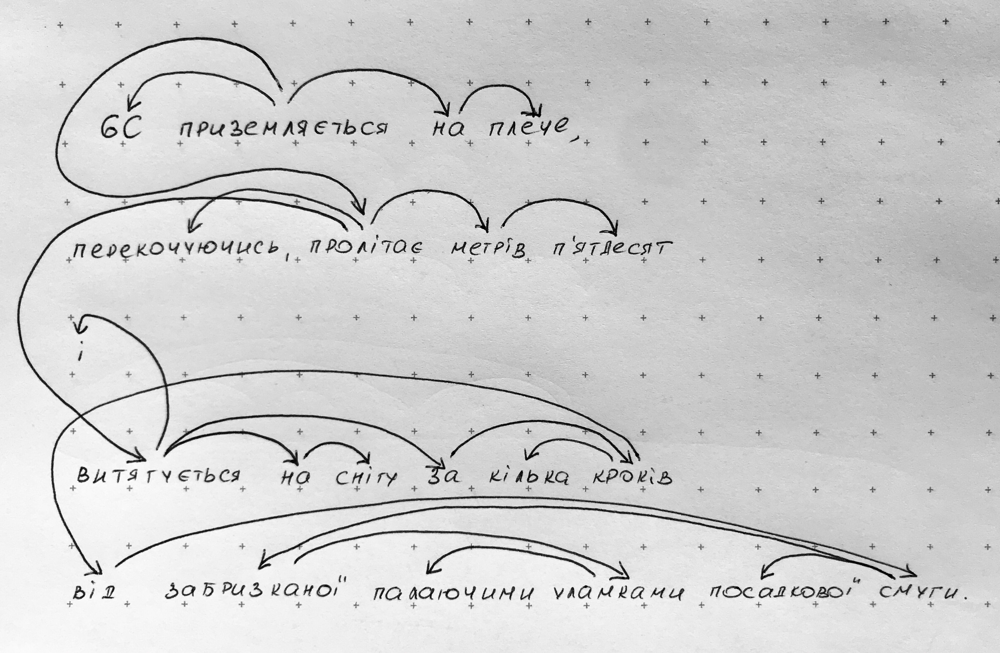

### Структурна лінгвістика

1. **Перевірте роботу SnowballStem для спільнокореневих слів. Напишіть ваші спостереження.**

   1. truth, truthful, truthfulness, countertruth (returns countertruth but `counter` is a prefix), untruthful (returns untruth, but `un` is a prefix), truthology (returns trutholog, but `log` is a suffix)
   2. flaw, flaws, flawed, flawless (returns flawless but `less` is a suffix), flawlessness (returns flawless but `less` is a suffix), flawlessly (the same),
   3. лес, лесной (вертає "лесн", хоча `"н"` - це суфікс), лесник (вертає "лесник", суфікс `"н"`), лесничий (вертає "леснич", `"нич"` - суфікс), лесничество (вертає "лесничеств", тут два суфікси - `"нич"` і `"еств"`, пролесье (вертає "пролес", `"про"` - це префікс)
   4. окно, окошко (вертає "окошко", має бути "окош" бо `"к"` - суфікс), подоконник (вертає "подоконник", має бути "окон", бо `"под"` - префікс, `"ник"` - закінчення), оконный, окнище (вертає "окнищ", має бути "окн", бо `"ищ"` - суфікс)

2. **Визначте частину мови виділеного слова і зв'язок до його батька (за зразком) - en:**

   1. We can {but} hope that everything will be fine. _: particle, hope_
   2. It's sad {but} true. _: conjunction, sad_
   3. Jack brings nothing {but} trouble. _: preposition, nothing_
   4. Let's do it this {way}! _: noun, do_
   5. This is {way} too much! _: adverb, too_
   6. The prices are going {down}. _: adverb, going_
   7. Someone pushed him and he fell {down} the stairs. _: preposition, fell_
   8. I’ve been feeling rather {down} lately. _: adverb, feeling_
   9. It's not easy to {down} a cup of coffee in one gulp. _: verb, ROOT_
   10. Bring a {down} jacket and a pair of gloves, and you'll be fine. _: adjective, jacket_

3. **Визначте частину мови виділеного слова і слово, яке є його батьком (за зразком) - укр:**

   1. Рада міністрів Європейського союзу затвердила угоду про спрощений порядок видачі {віз} для України. _: іменник, видачі_
   2. Батько Себастьяна {віз} на санях їх театральний гурт до Львова. _: дієслово, ROOT_
   3. А ще дивний елемент інтер’єру – {віз} із продукцією одного з херсонських виробників. _: іменник, ROOT_
   4. У цю мить {повз} Євгена пролетів останній вагон товарняка. _: прийменник, пролетів_
   5. Кліпнув очима і побачив малого песика, який саме пробігав {повз} у бік села. _: прислівник, пробігав_
   6. Степанко перестав кричати, тільки ламкий стогін {повз} йому із грудей. _: дієслово, ROOT_
   7. Ось присіла на {край} ліжка. _: іменник, на_
   8. Поставив ту кузню не {край} дороги, як було заведено, а на Красній горі, біля Прадуба. _: прислівник, поставив_
   9. Розповідаючи про передній {край} лінґвістики, фон Лібіх, як завжди, мислив широко і глобально. _: іменник, про_
   10. Не {край} мені серце. _: дієслово, ROOT_

4. **Виберіть одне речення зі списку та побудуйте для нього дерево залежностей:**

6C приземляється на плече, перекочуючись, пролітає метрів п’ятдесят і витягується на снігу за кілька кроків від забризканої палаючими уламками посадкової смуги.

5. **Виберіть одне cлово зі списку та побудуйте лексико-семантичні зв'язки до трьох різних значень цього слова.**

куля (геометричне тіло)

- синоніми: сфера, шар
- мероніми: сегмент, зріз, сектор
- гіпероніми: тіло

куля (снаряд для стрільби з вогнепальної зброї)

- синоніми: снаряд, набій
- мероніми (у розмовній мові, якщо слово вживається у значенні "набій"): гільза, порох, капсуль
- голоніми: набій
- гіпоніми: суцільнометалева оболонка
- гіпероніми: боєприпас

куля (милиця)

- синоніми: костур, ціпок
- мероніми: руків'я
- гіпоніми: канадка
- гіпероніми: палиця
