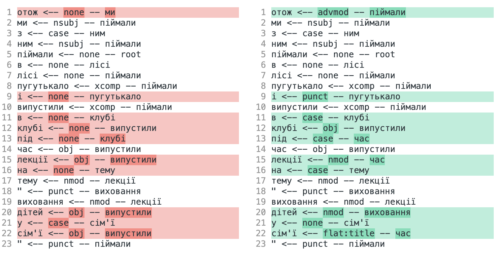
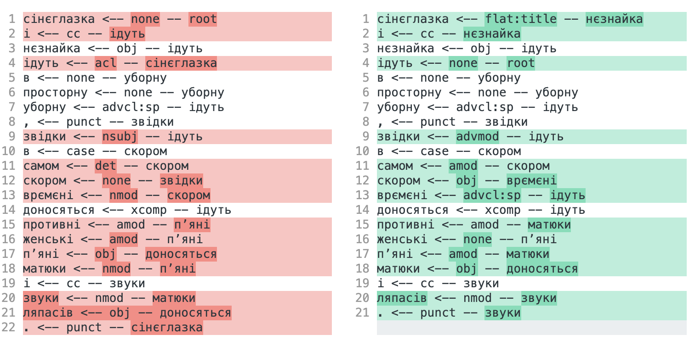
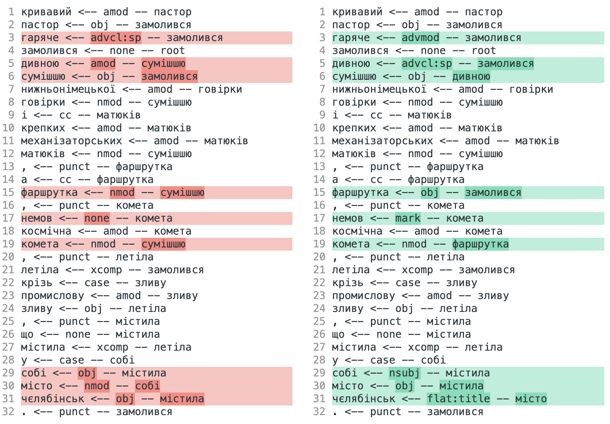

## Покращення парсера

З самого початку ігри зі `swap` мені здалися неблагонадійними, тому навіть не намагалась 😄 Сконцентрувалась на фічах.
В результатах фігурують тільки ті ітерації, які призвели до бодай якихось покращень

0. Бейзлайн (власне, те, що було написано на практичному занятті)

```
              precision    recall  f1-score   support

        left       0.86      0.87      0.86      6371
      reduce       0.85      0.78      0.81      6875
       right       0.75      0.79      0.77      5996
       shift       0.85      0.87      0.86      6578

    accuracy                           0.83     25820
   macro avg       0.83      0.83      0.83     25820
weighted avg       0.83      0.83      0.83     25820

== Attachment score report ==
Total:  12574
Match unlabeled:  8717
UAS:  0.69
Full match: 0.09
```

1. Фічі (`'feats'`) `S[0], S[1], Q[0], Q[1]` (трошки покращилось)

```
              precision    recall  f1-score   support

        left       0.87      0.89      0.88      6371
      reduce       0.86      0.81      0.83      6875
       right       0.78      0.80      0.79      5996
       shift       0.87      0.88      0.87      6578

    accuracy                           0.85     25820
   macro avg       0.85      0.85      0.85     25820
weighted avg       0.85      0.85      0.85     25820

== Attachment score report ==
Total:  12574
Match unlabeled:  9089
UAS:  0.72
Full match: 0.11
```

2. Типи залежностей (`'deprels'`), а також `LDEP/RDEP` для `S[0]` та `S[1]` (показує покращення на тестових даних, але на нових працює погано (бо там немає типів залежності), губить слова... тому далі не використовую)

```
              precision    recall  f1-score   support

        left       0.94      0.96      0.95      6371
      reduce       0.92      0.87      0.90      6875
       right       0.89      0.91      0.90      5996
       shift       0.93      0.94      0.94      6578

    accuracy                           0.92     25820
   macro avg       0.92      0.92      0.92     25820
weighted avg       0.92      0.92      0.92     25820

== Attachment score report ==
Total:  12574
Match unlabeled:  10495
UAS:  0.83
Full match: 0.23
```

3. Фічі (`'feats'`) для `LDEP/RDEP` (практично не помітно покращення, але )

```
              precision    recall  f1-score   support

        left       0.87      0.89      0.88      6371
      reduce       0.85      0.81      0.83      6875
       right       0.79      0.80      0.79      5996
       shift       0.86      0.88      0.87      6578

    accuracy                           0.85     25820
   macro avg       0.84      0.85      0.84     25820
weighted avg       0.85      0.85      0.85     25820

== Attachment score report ==
Total:  12574
Match unlabeled:  9090
UAS:  0.72
Full match: 0.11
```

4. Шлях до рута (чомусь мені здалось, що це може мати значення). Покращення мінімальне, ну але теж най буде

```
              precision    recall  f1-score   support

        left       0.93      0.95      0.94      6371
      reduce       0.89      0.86      0.88      6875
       right       0.81      0.81      0.81      5996
       shift       0.87      0.88      0.87      6578

    accuracy                           0.88     25820
   macro avg       0.88      0.88      0.88     25820
weighted avg       0.88      0.88      0.88     25820

== Attachment score report ==
Total:  12574
Match unlabeled:  9051
UAS:  0.72
Full match: 0.14
```

## Використання парсера

Спочатку пробувала з варіантом, який натренований на типах залежностей. Результат виявився поганим (було загублено багато слів), тому викинула цю ітерацію з тренування і зупинилась на вже фінальному

Для порівняння пробувала і `pymorphy2`, і `stanza`

Вийшло наступне:




Як можна побачити, для речень, що парсились `stanza`, парсер знаходив залежності більш адекватно
