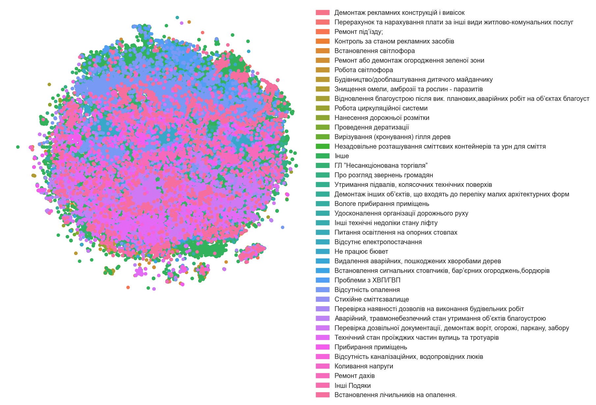

## Класифікатор

Щось геть важко зайшла задачка... Тому ітерацій вийшло зовсім мало

### 1. Підбір векторів

Спробувала підібрати вектори з [запропонованих](https://lang.org.ua/en/models/#anchor4)
Чомусь лематизовані вектори показали гірший результат, тому всі спроби лематизації довелось викинути
Найкраще підійшли вектори Ubercorpus lowercased tokenized LexVec. В той же час для категоризації, здалось, більш краще групування вийшло з Ubercorpus lowercased lemmatized Word2Vec

### 2. Групування категорій

Погрупувала категорії, ті, де менше 200 заявок, віднесла до категорії `Інше`, інші намагалась погрупувати за схожістю (вийшло загалом [63 топ-категорії](./cats_gr_all.json))

### 3. Препроцесинг тексту

Як зазначалось вище, лематизація не спрацювала, тільки ловерізація
Результат поки що дуже поганий

```
                                                                                  precision    recall  f1-score   support

                                                                            Інше       0.40      0.63      0.49      8221
                                                                     Інші Подяки       0.50      0.17      0.25       154
                                              Інші технічні недоліки стану ліфту       0.25      0.37      0.30       464
                Аварійний, травмонебезпечний стан утримання об’єктів благоустрою       0.37      0.42      0.39      1362
                                  Будівництво/дооблаштування дитячого майданчику       0.33      0.60      0.43       349
                                Видалення аварійних, пошкоджених хворобами дерев       0.42      0.32      0.36       165
                                                      Вилов безпритульних тварин       0.52      0.35      0.42        72
                                            Вирізування (кронування) гілля дерев       0.34      0.35      0.35       277
                                                     Вологе прибирання приміщень       0.42      0.53      0.47       218
                                           Встановлення лічильників на опалення.       0.33      0.39      0.35      1160
                                                           Встановлення пандусів       0.38      0.23      0.29        64
                                                         Встановлення світлофора       0.17      0.18      0.18        92
               Встановлення сигнальних стовпчиків, бар’єрних огороджень,бордюрів       0.20      0.26      0.22       149
Відновлення благоустрою після вик. планових,аварійних робіт на об’єктах благоуст       0.30      0.35      0.33       708
                                                      Відсутнє електропостачання       0.26      0.19      0.22       332
               Відсутність каналізаційних люків та решіток на проїжджих частинах       0.36      0.19      0.24        54
                                 Відсутність каналізаційних, водопровідних люків       0.37      0.18      0.24       124
                                                            Відсутність опалення       0.61      0.55      0.58      3968
                                                   ГЛ ”Несанкціонована торгівля”       0.52      0.43      0.47       439
                               Герметизація міжпанельних стиків (утеплення стін)       0.17      0.11      0.13        95
                                    Демонтаж рекламних вивісок з опорних стовпів       0.56      0.46      0.50       300
        Демонтаж інших об’єктів, що входять до переліку малих архітектурних форм       0.24      0.14      0.18       158
                      Евакуація безгосподарських, залишених транспортних засобів       0.72      0.19      0.30       120
                                        Забруднення повітря від невідомих джерел       0.30      0.28      0.29        78
                                        Заміна та експлуатація поштових скриньок       0.52      0.43      0.47      2905
                                  Знищення омели, амброзії та рослин - паразитів       0.97      0.72      0.83        97
                                                               Коливання напруги       0.56      0.53      0.55       126
                                            Контроль за станом рекламних засобів       0.42      0.21      0.28       184
                    Миття вікон, вітрин, вітражів, дзеркальних поверхонь, дверей       0.54      0.48      0.51       103
                                                    Нанесення дорожньої розмітки       0.55      0.38      0.45       148
                                                                 Не працює бювет       0.65      0.51      0.57      1136
               Незадовільне обслуговування в амбулаторно-поліклінічних установах       0.34      0.24      0.29      1386
               Незадовільне розташування сміттєвих контейнерів та урн для сміття       0.49      0.35      0.41       297
                                  Незадовільний стан кнопок виклику/наказу ліфту       0.44      0.25      0.32       162
Незручності для проживання мешканців від роботи закладів торгівлі та ресторанног       0.43      0.28      0.33       138
                                     Облаштування наземного пішохідного переходу       0.25      0.23      0.24        71
                                 Організація та проведення продовольчих ярмарків       0.35      0.39      0.37        61
                    Освітлення магістралей (проїжджих частин) та вулиць м. Києва       0.43      0.24      0.30       992
                                      Паркування авто на прибудинковій території       0.32      0.23      0.27       283
     Перевірка дозвільної документації, демонтаж воріт, огорожі, паркану, забору       0.56      0.44      0.49      1317
                     Перевірка наявності дозволів на виконання будівельних робіт       0.45      0.26      0.33       389
        Перерахунок та нарахування плати за інші види житлово-комунальних послуг       0.37      0.27      0.31       812
                                           Питання освітлення на опорних стовпах       0.41      0.17      0.24       260
                          Питання, що стосуються завершення опалювального сезону       0.74      0.23      0.35        75
                                                 Подяки загалом працівникам ЖЕКу       0.62      0.07      0.13        68
                                             Порушення правил тиші (після 22:00)       0.35      0.10      0.16        77
                                           Претензії та зауваження до Начальника       0.00      0.00      0.00        54
                                                            Прибирання приміщень       0.62      0.30      0.41       478
                                                   Про розгляд звернень громадян       0.27      0.14      0.18       490
                                                              Проблеми з ХВП/ГВП       0.67      0.69      0.68      3964
                                                          Проведення дезинсекції       0.39      0.15      0.22        85
                                                          Проведення дератизації       0.81      0.17      0.28       130
                                            Проведення модернізації/заміни ліфту       0.13      0.06      0.08        88
       Пропозиції та запитання щодо удосконалення роботи громадського транспорту       0.25      0.10      0.15        77
                                                                    Ремонт дахів       0.53      0.37      0.44       408
                                                                Ремонт під’їзду;       0.65      0.35      0.45       892
                                                           Ремонт фасаду будинку       0.57      0.16      0.25        76
                                                               Робота світлофора       0.79      0.44      0.56       243
                                                    Робота циркуляційної системи       0.16      0.12      0.14       298
                                             Розміщення паркувальних майданчиків       0.50      0.08      0.14        59
                                                          Стихійне сміттєзвалище       0.53      0.25      0.34       222
                                       Удосконалення організації дорожнього руху       0.27      0.24      0.25        80
                               Утримання підвалів, колясочних технічних поверхів       0.38      0.14      0.21       345

                                                                        accuracy                           0.46     38199
                                                                       macro avg       0.43      0.30      0.33     38199
                                                                    weighted avg       0.48      0.46      0.45     38199

```

### 4. Фільтрування мови

Відфільтрувала тільки українські звернення (ну, і, власне, відфільтрувались категорії, які включають звернення тільки уркїнською, тепер їх [41](./cats_gr_uk.json)). Результат все ще поганий, пічаль :(

```
                                                                                  precision    recall  f1-score   support

                                                                            Інше       0.59      0.77      0.67      8156
                                                                     Інші Подяки       0.55      0.12      0.20       101
                                              Інші технічні недоліки стану ліфту       0.29      0.39      0.33       204
                Аварійний, травмонебезпечний стан утримання об’єктів благоустрою       0.50      0.48      0.49       699
                                  Будівництво/дооблаштування дитячого майданчику       0.47      0.67      0.55       191
                                Видалення аварійних, пошкоджених хворобами дерев       0.55      0.39      0.46        92
                                            Вирізування (кронування) гілля дерев       0.49      0.32      0.39        69
                                                     Вологе прибирання приміщень       0.60      0.51      0.55       119
                                           Встановлення лічильників на опалення.       0.48      0.40      0.43       581
                                                         Встановлення світлофора       0.34      0.37      0.35        63
               Встановлення сигнальних стовпчиків, бар’єрних огороджень,бордюрів       0.12      0.12      0.12        76
Відновлення благоустрою після вик. планових,аварійних робіт на об’єктах благоуст       0.33      0.46      0.39       358
                                                      Відсутнє електропостачання       0.55      0.27      0.36       151
                                 Відсутність каналізаційних, водопровідних люків       0.41      0.28      0.33        69
                                                            Відсутність опалення       0.66      0.62      0.64      1928
                                                   ГЛ ”Несанкціонована торгівля”       0.62      0.44      0.51       245
                                        Демонтаж рекламних конструкцій і вивісок       0.35      0.26      0.30       624
        Демонтаж інших об’єктів, що входять до переліку малих архітектурних форм       0.20      0.06      0.09        72
                                  Знищення омели, амброзії та рослин - паразитів       0.95      0.81      0.87        88
                                                               Коливання напруги       0.73      0.59      0.65        59
                                            Контроль за станом рекламних засобів       0.45      0.21      0.28       106
                                                    Нанесення дорожньої розмітки       0.64      0.39      0.49       112
                                                                 Не працює бювет       0.74      0.58      0.65       531
               Незадовільне розташування сміттєвих контейнерів та урн для сміття       0.49      0.50      0.49       189
     Перевірка дозвільної документації, демонтаж воріт, огорожі, паркану, забору       0.65      0.57      0.60       843
                     Перевірка наявності дозволів на виконання будівельних робіт       0.49      0.26      0.34       172
        Перерахунок та нарахування плати за інші види житлово-комунальних послуг       0.45      0.41      0.43       337
                                           Питання освітлення на опорних стовпах       0.37      0.16      0.23       152
                                                            Прибирання приміщень       0.68      0.40      0.50       239
                                                   Про розгляд звернень громадян       0.30      0.16      0.21       305
                                                              Проблеми з ХВП/ГВП       0.48      0.36      0.41       353
                                                          Проведення дератизації       0.79      0.39      0.52        57
                                    Ремонт або демонтаж огородження зеленої зони       0.62      0.44      0.51      1554
                                                                    Ремонт дахів       0.52      0.48      0.50       211
                                                                Ремонт під’їзду;       0.58      0.40      0.47       503
                                                               Робота світлофора       0.77      0.63      0.69       135
                                                    Робота циркуляційної системи       0.15      0.16      0.15       147
                                                          Стихійне сміттєзвалище       0.44      0.26      0.33       134
                             Технічний стан проїжджих частин вулиць та тротуарів       0.52      0.30      0.38       431
                                       Удосконалення організації дорожнього руху       0.18      0.17      0.17        58
                               Утримання підвалів, колясочних технічних поверхів       0.43      0.19      0.26       189

                                                                        accuracy                           0.57     20703
                                                                       macro avg       0.50      0.38      0.42     20703
                                                                    weighted avg       0.56      0.57      0.55     20703

```

## Візуалізація

Дуже довго боролась, щоб взагалі зрозуміти, як змусити цю картинку малюватись, тому особливо ніяких естетичних красот не вийшло

