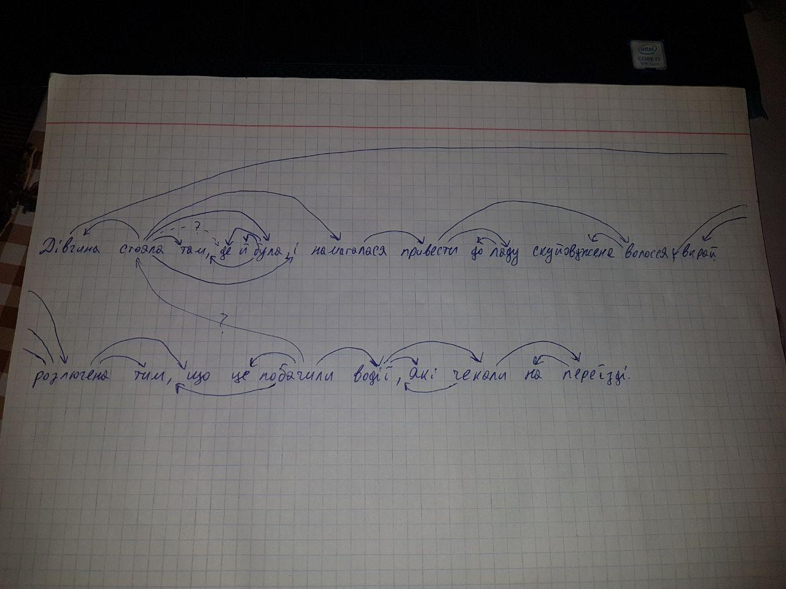

### 1-sling

Notebook with results [1-sling.ipyng](1-sling.ipyng)

#### Dependancy tree for sentence:

``Дівчина стояла там, де й була, і намагалася привести до ладу скуйовджене волосся, вкрай розлючена тим, що це побачили водії, які чекали на переїзді.``

#### Semantic links:
**Дух**

1.. Внутрішній стан, моральна сила людини, колективу.
  * гіпероніми: психологічний стан  
  * сестри: мораль, настрій  
  * гіпоніми: моральний дух, бойовий дух  
  * мероніми:  

2.. За міфологічними і релігійними уявленнями — добра або зла безплотна, надприродна істота, що бере участь у житті природи і людини.  
  * гіпероніми: істота  
  * сестри: привид, мавка  
  * гіпоніми: дух лісу, дух землі  
  * мероніми:  

3.. За релігійними уявленнями — безсмертна, нематеріальна основа в людині, що становить суть її життя і відрізняє від тварини  
  * гіпероніми: фізичний стан  
  * сестри: душа  
  * гіпоніми: дух Божий  
  * мероніми:  

### 2-headlines

Notebook with results [2-headlines.ipynb](2-headlines.ipynb)

#### Formatting
* Formatting accuracy on val set: 0.96
* Titles with no changes The Examiner: 0.1482 

#### Viral News
* Percentage of titles with NER: 52.70%
* Percentage of titles with positive sentiment: 37.54%
* Percentage of titles with negative sentiment: 22.58%
* Percentage of titles with neutral sentiment: 39.88%
* Percentage of titles with comparison degrees: 4.92%

P.S sentiment results may vary depends on sentiment approach

### 3-collocations

Notebook with results [3-collocations.ipynb](3-collocations.ipynb)

* English result ``collocations_en.json``
* Ukrainian result ``collocations_uk.json``

**Important!!!**
Чомусь ``json`` не зберігає корректно весь ``dict``, тому краще перезапустити самостійно, щоб впевнитись в результаті
