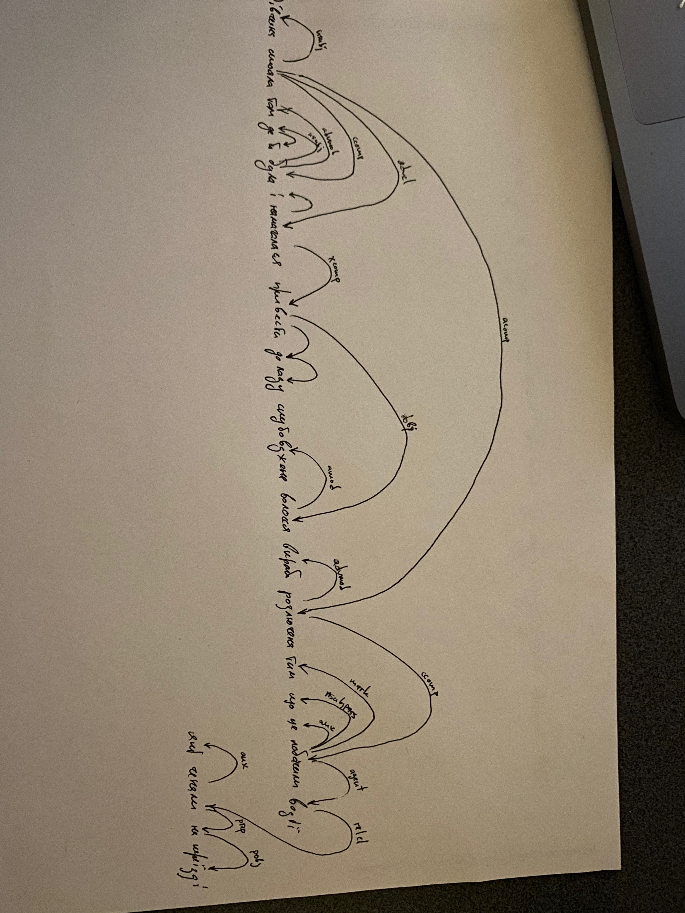

## Структурна лінгвістика

#### 1. Перевірте роботу [SnowballStem](http://snowballstem.org/) для спільнокореневих слів. Напишіть ваші спостереження.

1. truth, truth, truth, countertruth, untruth, untruth, trutholog
2. flaw, flaw, flaw, flawless, flawless, flawless 
3. лес, лесн, лесник, леснич, лесничеств, пролес
4. окн, окошк, подоконник, окон, окнищ

Наблюдения: 
- СноуболСтемер это набор алгоритмов написанных на языке Сноубол. Для стэмминга английского языка есть два варианта алгорима Портера, для русского языка также используется алгоритм с вручную задаными правилами и множеством суфиксов без баз основ. По-этому иногда алгоритм отрезает слишком много и мы получаем неправильный корень. 

- Портер стемер допускает ошибку overstemming приводя `truthful->truth`. Мне кажется, эти слова не являются синонимами. 

#### 2. Визначте частину мови виділеного слова і слово, яке є його батьком (за зразком):

1. We can {but} hope that everything will be fine.: coordinating conjunction, hope
2. It's sad {but} true.: coordinating conjunction, sad
3. Jack brings nothing {but} trouble.: adposition, nothing
4. Let's do it this {way}!: noun, do
5. This is {way} too much!: adverb, much
6. The prices are going {down}.: adverb, going
7. Someone pushed him and he fell {down} the stairs.: adposition, fell
8. I’ve been feeling rather {down} lately.: adverb, feeling
9. It's not easy to {down} a cup of coffee in one gulp.: adposition, 's
10.Bring a {down} jacket and a pair of gloves, and you'll be fine.: adjective, jacket

#### 3. Визначте частину мови виділеного слова і слово, яке є його батьком (за зразком):

1. Рада міністрів Європейського союзу затвердила угоду про спрощений порядок видачі {віз} для України.: іменник, видачі
2. Батько Себастьяна {віз} на санях їх театральний гурт до Львова.: дієслово, ROOT
3. А ще дивний елемент інтер’єру – {віз} із продукцією одного з херсонських виробників.: іменник, ROOT
4. У цю мить {повз} Євгена пролетів останній вагон товарняка.: прислівник, пролетів
5. Кліпнув очима і побачив малого песика, який саме пробігав {повз} у бік села.: прийменник, пробігав
6. Степанко перестав кричати, тільки ламкий стогін {повз} йому із грудей.: дієслово, стогін
7. Ось присіла на {край} ліжка.: іменник, ліжка
8. Поставив ту кузню не {край} дороги, як було заведено, а на Красній горі, біля Прадуба.: прийменник, дороги
9. Розповідаючи про передній {край} лінґвістики, фон Лібіх, як завжди, мислив широко і глобально.: іменник, лінґвістики
10. Не {край} мені серце.: дієслово, серце

#### 4. Виберіть одне речення зі списку та побудуйте для нього дерево залежностей:

#### 5. Виберіть одне cлово зі списку та побудуйте лексико-семантичні зв'язки до трьох різних значень цього слова.

вік

3 разных значения: 

# Существительное
- как возраст человека (синонимы: дитинство, юність, старість) (антоніми: )
- как обозначение временного переода с определёнными отличительными признаками (синонимы: століття, сторіччя) (гіпероніми: час) (мероніми: рік)

# Наречие 
- в смысле слишком долго, всегда (синонимы: тижнями, до нескінченності, тривалий час, годинами) (антоніми: миттєво, швидко, вмить) 

